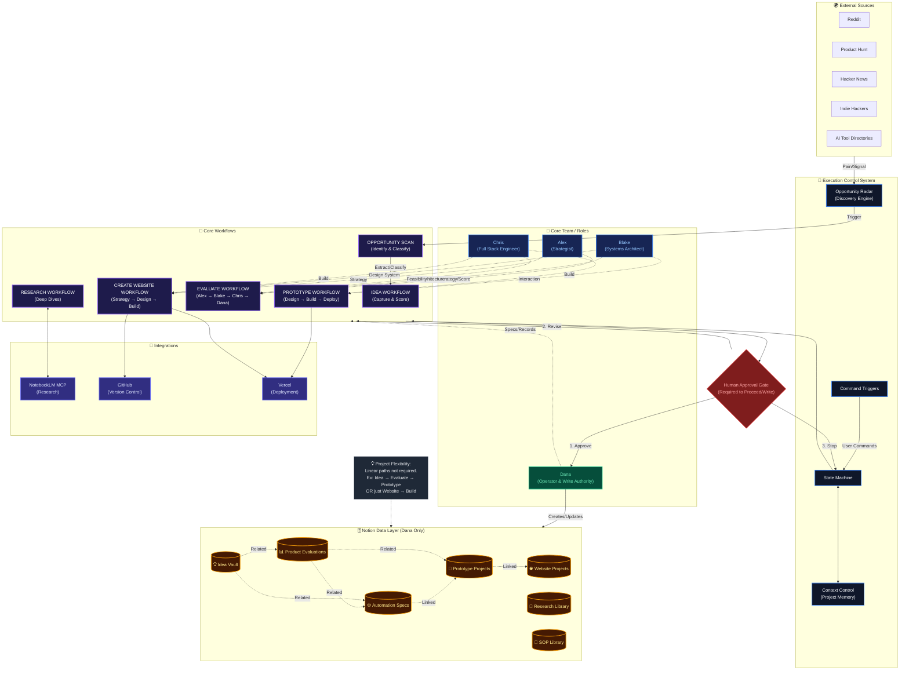

# FlowOps Studio OS v2 — Master Architecture

This document contains the Master System Architecture diagram for FlowOps Studio OS v2.
It represents the complete operating system, including the control layer, workflows, roles, integrations, and the Notion data layer.

