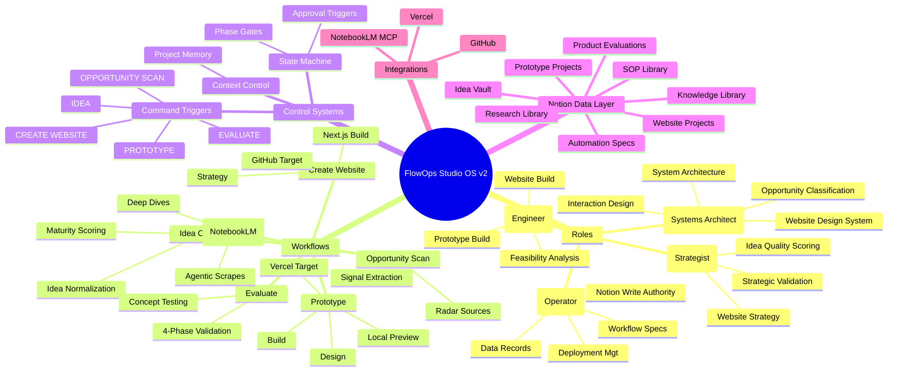

# FlowOps Studio OS v2 — Mind Map View

This document provides a hierarchical mind map overview of the FlowOps Studio OS v2 ecosystem,
breaking down the OS into its fundamental categories: Roles, Workflows, Systems, and Data Layer.

