# FlowOps Studio OS v2 — Workflow Flowchart

This document illustrates the sequential and flexible pathways between the core workflows in FlowOps Studio OS v2.
It details the phases, role handoffs, and approval gates.

```mermaid
graph TD
    %% STYLES
    classDef trigger fill:#1e1b4b,stroke:#8b5cf6,stroke-width:2px,color:#f8fafc;
    classDef infoSource fill:#0f172a,stroke:#3b82f6,stroke-width:1px,color:#93c5fd;
    classDef phase fill:#172554,stroke:#2563eb,stroke-width:2px,color:#eff6ff;
    classDef gate fill:#7f1d1d,stroke:#ef4444,stroke-width:2px,color:#fca5a5;
    classDef db fill:#064e3b,stroke:#10b981,stroke-width:2px,color:#a7f3d0;
    classDef endNode fill:#3f3f46,stroke:#71717a,stroke-width:1px,color:#e4e4e7;

    %% OPPORTUNITY RADAR
    subgraph Radar["📡 Opportunity Radar"]
        ScanCmd["Command: OPPORTUNITY SCAN"]
    class ScanCmd trigger
        Reddit["Reddit / Forums / PB"]
    class Reddit infoSource
        Extract["Extract Pain Points"]
    class Extract phase
        GenerateOpp["Generate Idea"]
    class GenerateOpp phase
        Classify["Classify Type (Service/SaaS)"]
    class Classify phase
        
        ScanCmd --> Reddit
        Reddit --> Extract
        Extract --> GenerateOpp
        GenerateOpp --> Classify
    end

    %% IDEA CAPTURE
    subgraph IdeaCapture["💡 Idea Capture Workflow"]
        IdeaCmd["Command: IDEA"]
    class IdeaCmd trigger
        Score["Maturity Score (0-8)"]
    class Score phase
        Suggest["Suggest Priority"]
    class Suggest phase
        
        IdeaCmd --> Score
        Score --> Suggest
    end

    %% EVALUATION WORKFLOW
    subgraph Evaluate["📊 Evaluation Workflow"]
        EvalCmd["Command: EVALUATE"]
    class EvalCmd trigger
        Phase1["Phase 1: Strategic Validation<br>(Alex: ICP, Quality Score, Productization)"]
    class Phase1 phase
        Phase2["Phase 2: System Architecture<br>(Blake: 3 Concepts, Classification)"]
    class Phase2 phase
        Phase3["Phase 3: Engineering Feasibility<br>(Chris: Tech Risk, API Data)"]
    class Phase3 phase
        Phase4["Phase 4: Automation Spec<br>(Dana: Spec Record)"]
    class Phase4 phase
        
        EvalCmd --> Phase1
        Phase1 --> Phase2
        Phase2 --> Phase3
        Phase3 --> Phase4
    end

    %% PROTOTYPE WORKFLOW
    subgraph Prototype["🧪 Prototype Workflow"]
        ProtoCmd["Command: PROTOTYPE"]
    class ProtoCmd trigger
        PPhase1["Phase 1: Interaction Design<br>(Blake: User Flow, UI)"]
    class PPhase1 phase
        PPhase2["Phase 2: Workflow Visual<br>(Blake: Diagrams)"]
    class PPhase2 phase
        PPhase3["Phase 3: Prototype Build<br>(Chris: Local Preview)"]
    class PPhase3 phase
        PPhase4["Phase 4: Deployment<br>(Dana: Vercel Push)"]
    class PPhase4 phase
        
        ProtoCmd --> PPhase1
        PPhase1 --> PPhase2
        PPhase2 --> PPhase3
        PPhase3 --> PPhase4
    end

    %% WEBSITE WORKFLOW
    subgraph Website["🌐 Website Workflow"]
        WebCmd["Command: CREATE WEBSITE"]
    class WebCmd trigger
        WPhase1["Phase 1: Strategy<br>(Alex: Goal, Audience)"]
    class WPhase1 phase
        WPhase2["Phase 2: Architecture<br>(Blake: Design System, Layout)"]
    class WPhase2 phase
        WPhase3["Phase 3: Build & Visuals<br>(Chris: Next.js, Premium UI)"]
    class WPhase3 phase
        WPhase4["Phase 4: Deployment<br>(Dana: GitHub/Vercel)"]
    class WPhase4 phase
        
        WebCmd --> WPhase1
        WPhase1 --> WPhase2
        WPhase2 --> WPhase3
        WPhase3 --> WPhase4
    end

    %% NOTION OUTCOMES
    Vault[("Idea Vault")]
    class Vault db
    EvalDB[("Product Evaluations")]
    class EvalDB db
    SpecDB[("Automation Specs")]
    class SpecDB db
    ProtoDB[("Prototype Projects")]
    class ProtoDB db
    WebDB[("Website Projects")]
    class WebDB db

    %% APPROVAL GATES
    Gate0{"Approve to Vault?"}
    class Gate0 gate
    Gate1{"Approve Idea?"}
    class Gate1 gate
    Gate2{"Approve Flow?"}
    class Gate2 gate
    Gate3{"Approve Local Build?"}
    class Gate3 gate
    Gate4{"Approve Live URL?"}
    class Gate4 gate
    Stop(("Stop Workflow"))
    class Stop endNode

    %% FLOW CONNECTIONS
    Classify --> Gate0
    Suggest --> Gate0
    Gate0 -->|Yes| Vault
    Gate0 -->|No / Revise| Stop
    
    Vault -.-> |Optional| EvalCmd
    Vault -.-> |Optional| ProtoCmd
    Vault -.-> |Optional| WebCmd
    
    Phase4 --> Gate1
    Gate1 -->|Yes| EvalDB
    Gate1 -->|Yes| SpecDB
    Gate1 -->|No| Stop
    
    SpecDB -.-> |Required for| ProtoCmd
    
    PPhase4 --> Gate2
    Gate2 -->|Yes| ProtoDB
    Gate2 -->|Deploy| Vercel
    Gate2 -->|No| Stop
    
    ProtoDB -.-> |Optional for| WebCmd
    
    WPhase4 --> Gate4
    Gate4 -->|Yes| WebDB
    Gate4 -->|Deploy| GitHub[GitHub & Vercel]
    Gate4 -->|No| Stop

    %% NOTES
    classDef note fill:#1f2937,stroke:#9ca3af,stroke-width:1px,color:#e5e7eb;
    Note["💡 Project Flexibility:<br>These flows do not require a rigid sequence.<br>You can launch a Website project without an Evaluation.<br>You can evaluate an Automation Spec without a Website."]
    class Note note
```

